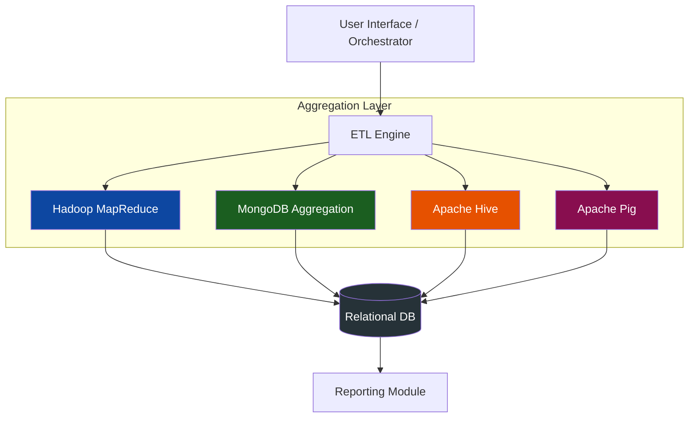

# 🌌 Multi-Pipeline ETL & Reporting Framework
### *Unified Big Data Analytics for Web Server Logs*


[](https://hadoop.apache.org/)
[](https://www.mongodb.com/)
[](https://openjdk.java.net/)
[](https://maven.apache.org/)
[](https://www.postgresql.org/)

---

## 📖 Project Overview

This project implements a robust, end-to-end **ETL (Extract, Transform, Load) and Reporting Framework** designed to process large-scale web server logs (NASA HTTP Logs). It features a pluggable architecture allowing users to swap between different processing backends—**Hadoop MapReduce**, **MongoDB**, **Hive**, and **Pig**—while maintaining a unified reporting layer in a relational database.

### 🎯 Key Objectives
- **Multi-Pipeline Flexibility**: Process the same dataset across diverse NoSQL and Big Data paradigms.
- **Strict Data Integrity**: Implement regex-based parsing with comprehensive error handling for malformed records.
- **Unified Reporting**: All results and run metadata are persisted to a central SQL database for cross-platform comparison.
- **Performance Benchmarking**: Automated tracking of runtime and processing statistics.

---

## 🛠 Architecture



---

## 📊 Processing Pipelines

The framework computes three mandatory analytical queries over the **NASA Kennedy Space Center logs**:

1.  **📈 Daily Traffic Summary**: Aggregates request counts and total bytes transferred per day, segmented by HTTP status codes.
2.  **🏆 Top Requested Resources**: Identifies the most visited URLs and resources across the entire dataset.
3.  **⚠️ Hourly Error Analysis**: Performs a deep dive into 4xx and 5xx errors, grouped by date and hour to identify peak failure times.

---

## 📂 Repository Structure

```bash
.
├── Query1/               # Daily Traffic Pipeline
│   ├── MR/               # Hadoop MapReduce Implementation
│   └── MongoDB/          # MongoDB Aggregation Implementation
├── Query2/               # Top Resources Pipeline
├── Query3/               # Hourly Error Analysis Pipeline
├── common/               # Shared logic
│   ├── Parsing/          # Regex LogParser & ParsedLog models
│   └── sql/              # Data Access Objects (DAOs) for SQL Storage
├── sql/                  # SQL Schema and initialization scripts
├── report.tex            # Comprehensive technical report (LaTeX)
└── Run_Instructions.txt  # Quick-start guide
```

---

## 🚀 Execution Guide

### 🐘 Running Hadoop MapReduce
```bash
# Compile and JAR
javac -classpath `hadoop classpath` -d . Project/common/Parsing/*.java Project/Query1/MR/DailyTrafficMR.java
jar -cvf Project/Query1/MR/DailyTrafficMR.jar Project

# Execute Job
hadoop jar Project/Query1/MR/DailyTrafficMR.jar Project.Query1.MR.DailyTrafficMR /Project/test.txt /Project/output
```

### 🍃 Running MongoDB Pipeline
```bash
# Ensure MongoDB service is running
mongod --dbpath ~/db

# Execute via Maven
mvn clean compile
mvn exec:java -Dexec.mainClass="Project.Query1.MongoDB.Q1Mongo" -Dexec.args="Project/common/test.txt"
```

---

## 🔍 Parsing Strategy

The framework utilizes a high-performance **Master Regular Expression** to extract 9 distinct fields from the Combined Log Format:

```regex
^(\S+)\s+\S+\s+\S+\s+\[(\d{2}/\w{3}/\d{4}):(\d{2}):\d{2}:\d{2}\s+[+-]\d{4}\]\s+"([A-Z]+)\s+(\S+)\s+(HTTP/[\d.]+)"\s+(\d{3})\s+(\S+)$
```

- ✅ **Host, Timestamp, Method, Path, Protocol, Status, Bytes** are all captured.
- 🧹 **Data Cleaning**: Automatically handles `-` characters in byte fields, converting them to `0`.
- 🚨 **Malformed Tracking**: Records failing to match the regex are counted and reported as "Malformed" rather than silently ignored.

---

## 📝 Authors & Acknowledgments
- **Project Type**: End Semester Project (DAS 839 - NoSQL Systems)
- **Dataset**: NASA Kennedy Space Center HTTP Logs (Jul-Aug 1995)
- **Framework developed by**: [Group Members]

---
<p align="center">
  <i>Developed with ❤️ for the NoSQL & Big Data Community</i>
</p>
